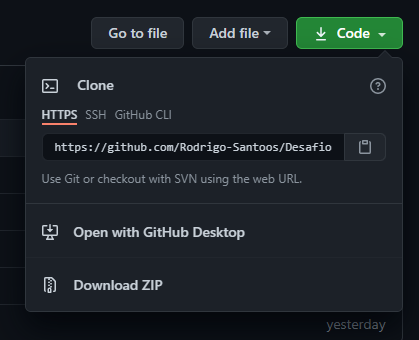

<div align="center">

</div>

# Projeto realizado conforme desafio fornecido para processo seletivo  


## 🚀 O Desafio

A agência Divulga Tudo precisa de um programa para gerenciar os seus anúncios online. O objetivo dos anúncios faz parte de uma campanha nas redes sociais. O sistema de gerenciamento permitirá a gestão do anúncio e o rastreio dos resultados da campanha.

Considere os seguintes critérios fictícios para desenvolver o cadastro de anúncios:

- a cada 100 pessoas que visualizam o anúncio 12 clicam nele.
- a cada 20 pessoas que clicam no anúncio 3 compartilham nas redes sociais.
- cada compartilhamento nas redes sociais gera 40 novas visualizações.
- 30 pessoas visualizam o anúncio original (não compartilhado) a cada R$ 1,00 investido.
- o mesmo anúncio é compartilhado no máximo 4 vezes em sequência

Crie um sistema que permita o cadastro de anúncios. O anúncio deverá conter os seguintes dados:

- nome do anúncio
- cliente
- data de início
- data de término
- investimento por dia


O sistema fornecerá os relatórios de cada anúncio contendo:

- valor total investido
- quantidade máxima de visualizações
- quantidade máxima de cliques
- quantidade máxima de compartilhamentos

Os relatórios poderão ser filtrados por intervalo de tempo e cliente.

### 📋 Pré-requisitos

```
Ter o Python 3.9.5 instalado 
Ide de sua preferência
```

### 🔧 Execução

Para acessar a aplicação :

```
Faça o download ( clone ) do repositório - [Rodrigo](https://github.com/Rodrigo-Santoos) 
```

```
Abra o projeto com a Ide de preferência ( Python, Vscode, Pycharm ...)
```

```
Rode a aplicação
```

```
Após iniciar a aplicação será listada as opçoes de execução. 
```

```
Execultando o codigo. 
```
* O codigo pedira para voce digitar entre 0 a 5,
```

## 🛠️ Aplicação construída com 

* [Windows:](https://www.python.org/downloads/)
* [Linux:](https://www.python.org/downloads/source/) 
* [MacOS:](https://www.python.org/downloads/mac-osx/)


## ✒️ Desenvolvido por

* **Rodrigo Oliveira** - [Rodrigo Oliveira](https://github.com/Rodrigo-Santoos)
